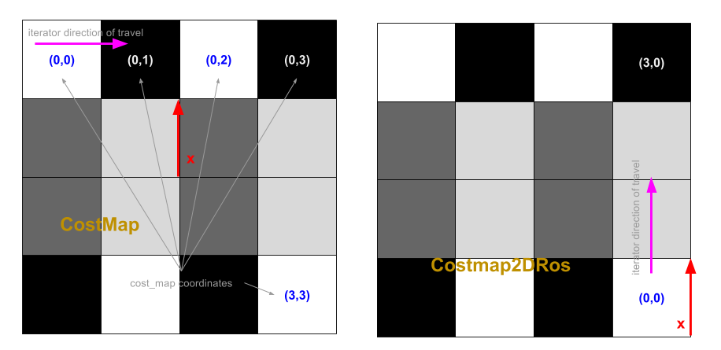

# ROS Costmap

This repository stores the information and demonstration of ROS costmap. Please also refer to ros-move-base for costmap apllication in move_base.

## Content

- [Navigation and Costmap](#Navigation-and-Costmap)
- [Reference](#Reference)

## Navigation and Costmap

In the navigation stack, move_base node, it maintains two costmaps. The `planner_costmap_ros` and `controller_costmap_ros`. The `planner_costmap_ros` is used as a map for global navigation whereas the `controller_costmap_ros` is used for a local navigation map.  

Below are the steps costmap initialize itself:  

- Obtain coordinate transformation(global and robot's coordinate system)
- Add echo plugin layer [addPlugin]
- Set footprint [setUnpaddedRobotFootprintPolygon]
- Publish visualize messages [Costmap2DPublisher]
- Set timer to detect robot's movement [movementCB]
- Activate dynamic parameter server [reconfigureCB]
- Activate update map thread [mapUpdateLoop]

Comparison between grid_map and costmap_2d.  

## Reference

- costmap diagram [link](https://blog.csdn.net/feidaji/article/details/103178619?ops_request_misc=%257B%2522request%255Fid%2522%253A%2522160497155519725222449565%2522%252C%2522scm%2522%253A%252220140713.130102334..%2522%257D&request_id=160497155519725222449565&biz_id=0&utm_medium=distribute.pc_search_result.none-task-blog-2~all~sobaiduend~default-2-103178619.pc_first_rank_v2_rank_v28&utm_term=costmap_2d)
- multi-layer costmap paper (David V. Lu) [link](http://wustl.probablydavid.com/publications/IROS2014.pdf)
- costmap parameter explanation [link](https://www.google.com/url?sa=t&rct=j&q=&esrc=s&source=web&cd=&ved=2ahUKEwjHqv2s6vbsAhXJFLcAHaH7Bg8QFjAIegQIChAC&url=http%3A%2F%2Fu.cs.biu.ac.il%2F~yehoshr1%2F89-685%2FFall2013%2FROSLesson5.pptx&usg=AOvVaw3FxoM_cf7qIXKICrBiDGxP)
- navigation and costmap [link](https://blog.csdn.net/qq_41925420/article/details/86636141)
